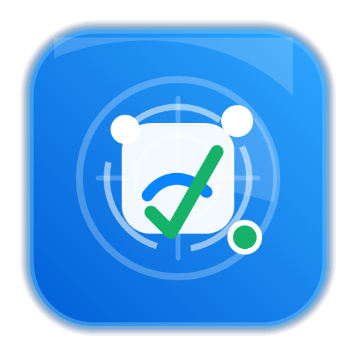

# ASC Radar

<p align="center">
  
</p>

ASC Radar 是一个 Windows 桌面版 App Store Connect 多账号审核状态管理工具。它用于集中管理多个 Apple 开发者账号，通过 App Store Connect API 同步账号下的 App、版本审核状态、产品页面优化审核状态，并在状态变化时弹出桌面提醒。

> 本项目不是 Apple 官方工具，也不会保存 Apple ID 密码或验证码。同步能力基于 App Store Connect API Key。

## 下载

Windows 运行版请到 Releases 下载压缩包：

[下载 ASC Radar 最新版本](https://github.com/zaishui1fang/ASC-Radar/releases)

下载后解压，双击 `ASC Radar.exe` 启动。仓库里的 `Code` 下载的是源码，不是推荐给普通用户直接使用的运行包。

## 功能特性

- 多账号管理：支持添加、编辑备注、删除 App Store Connect API 账号。
- App 状态看板：按账号筛选 App，查看版本、构建、审核状态和产品页面优化状态。
- 审核状态区分：版本状态和产品页面优化状态分开展示，避免混在一起。
- 状态颜色标识：等待审核、审核中、可分发、被拒绝等状态使用不同颜色突出显示。
- 状态变化提醒：审核状态变化时在电脑右下角显示自定义通知浮窗。
- App 详情页：点击 App 可查看版本和产品页面优化的状态变化时间线。
- 自动同步：支持后台自动同步关键审核状态。
- 新 App 发现：支持手动发现新 App，也可开启低频自动发现。
- 托盘后台运行：关闭窗口可缩到右下角托盘，自动同步继续运行。
- 便携运行：项目文件夹可复制到其他 Windows 电脑使用。

## 同步规则

自动同步会根据当前状态调整频率：

- 审核中：约 1 分钟检查一次。
- 等待审核：约 5 分钟检查一次。
- 其他状态：约 15 分钟检查一次。

新 App 自动发现默认关闭。开启后可选择每 3 / 6 / 9 小时低频扫描一次。发现新 App 后只加入列表，不弹出通知；只有审核状态变化才会弹出通知。

## 状态时间说明

详情页里的时间线记录的是“工具检测到状态变化的时间”。如果工具没有运行，或自动同步间隔较长，时间可能晚于 Apple 后台真实变化时间。

## 运行环境

- Windows 10 / Windows 11
- Windows PowerShell 5.1
- .NET Framework 4.x
- 项目内置 `runtime/node.exe` 用于调用 App Store Connect API

## 快速开始

1. 下载或复制完整项目文件夹。
2. 双击 `ASC Radar.exe` 启动。
3. 添加账号：
   - 账号名称
   - Issuer ID
   - Key ID
   - `.p8` 私钥内容
   - 备注
4. 保存账号后同步 App。
5. 在 `App 状态` 页面查看审核状态，点击 App 可进入详情页。

如果 Windows 拦截 exe，可使用备用入口：

- `启动桌面版.vbs`
- `start.cmd`

## App Store Connect API Key

工具需要使用 App Store Connect API Key 登录接口，不支持 Apple ID 密码和验证码登录。你需要准备：

- Issuer ID
- Key ID
- `.p8` 私钥

建议为工具创建专用 API Key，并只授予必要权限。

## 安全提醒

本工具会在本地保存账号配置、同步结果和加密后的私钥数据。上传 GitHub 前，请务必确认以下文件没有被提交：

- `data/store.json`
- `data/local.key`
- `data/icons/`
- 任意 `.p8` 私钥文件

`.gitignore` 已默认忽略这些本地数据。不要把真实账号数据、私钥、Apple ID 密码、验证码上传到公开仓库。

## 项目结构

```text
ASC Radar.exe              桌面启动器
start.cmd                  调试/备用启动入口
启动桌面版.vbs              备用静默启动入口
assets/                    应用 Logo 和图标资源
data/                      本地数据目录，禁止上传真实数据
runtime/node.exe           内置 Node.js 运行时
src/App.ps1                WPF 主程序逻辑
src/App.xaml               WPF 界面布局
src/apple-sync.js          App Store Connect API 调用
src/sync-worker.ps1        后台同步任务
src/settings-writer.ps1    设置保存任务
tools/                     Logo 生成和启动器源码
```

## 开发与构建

检查脚本语法：

```powershell
powershell.exe -NoProfile -Command "$null = [scriptblock]::Create((Get-Content -LiteralPath 'src\App.ps1' -Raw -Encoding UTF8)); 'App.ps1 OK'"
powershell.exe -NoProfile -Command "$null = [scriptblock]::Create((Get-Content -LiteralPath 'src\sync-worker.ps1' -Raw -Encoding UTF8)); 'sync-worker.ps1 OK'"
runtime\node.exe --check src\apple-sync.js
```

重新生成 Logo：

```powershell
powershell.exe -NoProfile -ExecutionPolicy Bypass -File tools\generate-logo.ps1
```

重新编译启动器：

```powershell
$asm = Get-ChildItem -Path $env:WINDIR\Microsoft.NET\assembly\GAC_MSIL\System.Management.Automation -Recurse -Filter System.Management.Automation.dll | Select-Object -First 1 -ExpandProperty FullName
& "$env:WINDIR\Microsoft.NET\Framework64\v4.0.30319\csc.exe" /nologo /target:winexe /out:"ASC Radar.exe" /win32icon:"assets\app-logo.ico" /reference:System.Windows.Forms.dll /reference:"$asm" "tools\Launcher.cs"
```

## GitHub 上传前检查

上传前建议执行：

```powershell
git status
```

确认 `data/store.json`、`data/local.key`、`.p8` 私钥文件没有出现在待提交列表中。

如果只想维护源码仓库，可以把完整便携版 ZIP 放到 GitHub Releases；仓库里只保存源码和说明。
